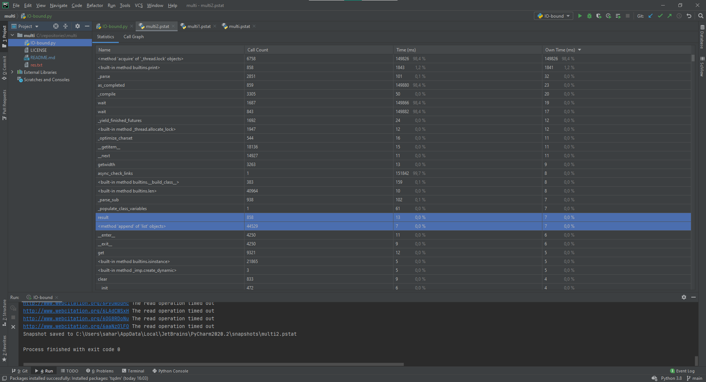

# IO-bound

## синхронная проверка:

## 5 воркеров:

## 10 воркеров:

## 100 воркеров:

С увеличением количества потоков увеличивается нагрузка на процессор , нагрузка на память практически не меняется, а нагрузка на сеть увеличивалась постепенно, пропорциально увеличению нагрузки. Время работы уменьшалось.
# CPU-bound.

## генерация на 1 ядре:

## 2 воркерa:

## 4 воркерa:

## 5 воркеров:

## 10 воркеров:

Я делал снэпшоты после генерации одной монеты. Большее количество воркеров немного увеличивает скорость, но так же увеличивает нагрузку.
Последнее увеличение количества воркеров бессмысленно. Уменьшение разницы видно уже в случае 4 и 5 воркеров. В случае 10 воркеров мне вообще не повезло и искалось в разы дольше даже чем с 4 воркерами. Так что увеличение воркеров настолько не показало своей эффективности, в отличии от 1 задачи.